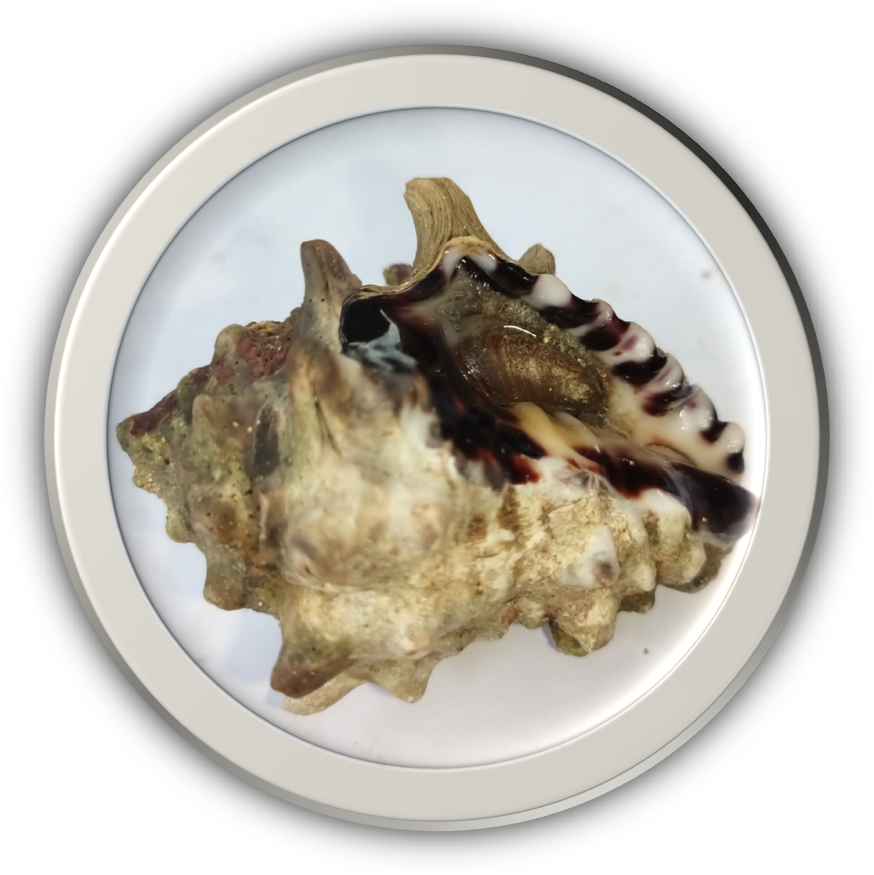

<div align="center">
  
</div>

<h1 align="center">Automated Gastropod Species Classification Using Deep Learning</h1>

<div align="center">

[](https://docs.ultralytics.com/tasks/segment/)
[](https://colab.research.google.com/drive/1OQhemZ8wla1PHqW3nBOknM4h3jFe_mjc)
[](https://colab.research.google.com/drive/1kerUUC8y-leDWJzGKsLozcYbfyAshahd)
[](https://universe.roboflow.com/gastropoda-qaadk/gastropod-final/dataset/2)

</div>

## 📖 Project Overview

<div align="justify">

This project automates the taxonomic classification of marine gastropods using deep learning. Powered by the [Ultralytics YOLO algorithm](https://docs.ultralytics.com/models/yolov8/), the system performs real-time video classification and instance segmentation to identify 23 distinct species accurately. To enable real-world inferencing, the model is deployed as an Edge AI solution on a Raspberry Pi 4 Model B equipped with a Raspberry Pi Camera Module v2.
</div>


## ✨ Key Features

<div align="justify">

* Integrates a Deep Learning model designed for gastropod classification and instance segmentation.
* Fully optimized for edge deployment on a Raspberry Pi 4 Model B with a Raspberry Pi Camera Module v2.
* Performs live, on-device inferencing for immediate specimen identification without the need for cloud computing.
* Achieves highly robust spatial accuracy, achieving an overall mAP@50-95 of 92%–94%.
</div>


## 🚀 Deployment Guide

<div align="justify">

This guide provides step-by-step instructions to set up the YOLOv8 gastropod classification environment. While the system is developed for Edge AI deployment on a Raspberry Pi 4 Model B, these instructions are fully compatible across Windows, macOS, and Linux environments.
</div>

1. Open your terminal or command prompt.

2. Navigate to your desired directory.
    ```bash
    cd /path/to/your/desired/directory
    ```
3. Clone the repository.
    ```bash
    git clone https://github.com/ejramirez525/automated-gastropod-species-classification-using-deep-learning.git
    ```
4. Change to the cloned repository's directory.
    ```bash
    cd Automated-Gastropod-Species-Classification-Using-Deep-Learning
    ```
5. Create a virtual environment.
    - **For Windows:**
        ```bash
        python -m venv venv
        ```
    - **For macOS and Raspberry Pi (Linux):**
        ```bash
        python3 -m venv venv
        ```
6. Activate the virtual environment.
    - **For Windows (Command Prompt):**
        ```bash
        venv\Scripts\activate
        ```
    - **For Windows (PowerShell):**
        ```bash
        .\venv\Scripts\Activate.ps1
        ```
    - **For macOS and Raspberry Pi (Linux):**
        ```bash
        source venv/bin/activate
        ```
7. Install the required dependencies.

    > **NOTE:** Ensure your virtual environment is active, then install the required packages.
    ```bash
    pip install -r requirements.txt
    ```
8. Run the software
    ```bash
    python Gastropod_Classification.py
    ```


## 🏆 Research Output

<div align="center">

**Best in Thesis 🏅**<br>
**Department of Computer Studies Research Exhibit 2024**

<br>


<p align="center">
<i>Official Research Tarpaulin presented at the Department of Computer Studies, NEMSU Cantilan Research Exhibit.</i>
</p>

</div>

---